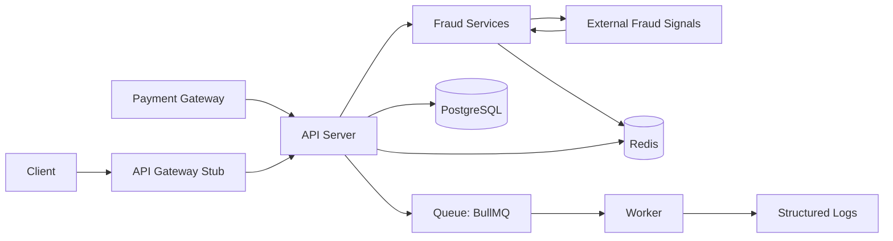
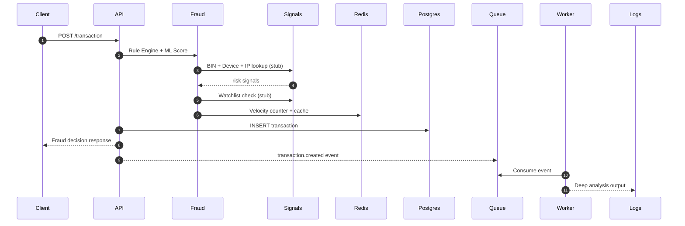

# Real-Time Fraud Detection System (Node.js)

A production-style prototype that simulates real-time fraud detection using rule checks, mock ML scoring, Redis caching, and async processing via BullMQ. It now includes PostgreSQL persistence for all transactions.

## Architecture Diagram



## Data Flow Diagram



## Project Structure

```
src/
  api/
    routes/
    controllers/
  services/
    fraud/
      ruleEngine.js
      mlService.js
      aggregator.js
      enrichmentService.js
      historicalService.js
    transactionService.js
  queue/
    producer.js
    worker.js
  cache/
    redisClient.js
  gateway/
    auth.js
  db/
    postgres.js
    migrate.js
    schema.sql
    seed.js
  integrations/
    adapters/
      httpAdapter.js
    ml/
      mlScoringClient.js
    paymentGateway/
      adapter.js
      webhookVerifier.js
    fraudSignals/
      binLookup.js
      deviceFingerprint.js
      ipReputation.js
      watchlist.js
      watchlistClient.js
  models/
    transactionRepository.js
    featureStoreRepository.js
  utils/
  config/
  app.js
server.js
ROADMAP.md
```

## Setup & Execution

### 1) Install dependencies

```
npm install
```

### 2) Configure environment

```
copy .env.example .env
```

### 3) Start Redis

```
docker compose up -d redis
```

### 4) Start PostgreSQL

Option A: Docker (recommended)

```
docker compose up -d postgres
```

Option B: pgAdmin (local install)

1. Create a database named `fraud_demo`
2. Ensure your `.env` matches your local credentials

### 5) Run database migration

```
npm run db:migrate
```

### 6) Seed sample history (optional)

```
npm run db:seed
```

### 7) Start API and worker (separate terminals)

```
npm run dev
```

`npm run dev` uses nodemon for auto-reload on file changes.

```
npm run worker
```

## Environment Variables

Key values are in `.env.example`:

- `REDIS_URL`
- `DATABASE_URL`
- `AMOUNT_THRESHOLD`
- `VELOCITY_MAX_TX`
- `ML_TIMEOUT_MS`
- `GATEWAY_API_KEY` (optional)
- `PAYMENT_WEBHOOK_SECRET` (optional)
- `HISTORICAL_WINDOW_DAYS`
- `HISTORICAL_AMOUNT_SPIKE`
- `HISTORICAL_MAX_TX`
- `WATCHLIST_USER_IDS`
- `WATCHLIST_DEVICE_IDS`
- `USE_REAL_ML`
- `ML_SCORING_ENDPOINT`
- `USE_REAL_WATCHLIST`
- `WATCHLIST_ENDPOINT`

## Feature Flags and Adapters

- `USE_REAL_ML=true` switches scoring to the external ML adapter in `src/integrations/ml/mlScoringClient.js`.
- `USE_REAL_WATCHLIST=true` switches watchlist checks to the external adapter in `src/integrations/fraudSignals/watchlistClient.js`.
- Both adapters use the shared `HttpAdapter` with retries, timeouts, and a circuit breaker.
- `ML_SCORING_ENDPOINT` and `WATCHLIST_ENDPOINT` should be full URLs.

## API Usage

### POST /transaction

Request:

```json
{
  "userId": "user-123",
  "amount": 1250,
  "deviceId": "device-abc",
  "cardBin": "411111",
  "ipAddress": "203.0.113.10"
}
```

Example curl:

```
curl -X POST http://localhost:3000/transaction \
  -H "Content-Type: application/json" \
  -d '{"userId":"user-123","amount":1250,"deviceId":"device-abc","cardBin":"411111","ipAddress":"203.0.113.10"}'
```

Sample response:

```json
{
  "transactionId": "d4fb6a88-3e7e-43d7-a9d1-8b4ed3d98959",
  "userId": "user-123",
  "amount": 1250,
  "deviceId": "device-abc",
  "decision": "APPROVE",
  "score": 0.4321,
  "triggeredRules": [],
  "ruleResults": [
    {
      "id": "velocity_check",
      "passed": true,
      "reason": "User has 2 tx in 60s",
      "meta": {
        "count": 2,
        "windowSec": 60,
        "exceeded": false,
        "skipped": false
      }
    },
    {
      "id": "amount_threshold",
      "passed": true,
      "reason": "Amount within threshold",
      "meta": {
        "amount": 1250,
        "threshold": 10000
      }
    }
  ],
  "mlResult": {
    "model": "mock-ml-v1",
    "score": 0.4321,
    "latencyMs": 71,
    "timedOut": false
  },
  "signals": {
    "bin": {
      "bin": "411111",
      "network": "VISA",
      "issuerCountry": "US",
      "risk": 0.15,
      "latencyMs": 34,
      "source": "bin-db-stub"
    },
    "device": {
      "deviceId": "device-abc",
      "risk": 0.31,
      "isNewDevice": false,
      "confidence": 0.71,
      "latencyMs": 44,
      "source": "device-fingerprint-stub"
    },
    "ip": {
      "ipAddress": "203.0.113.10",
      "risk": 0.7,
      "reputation": "test-net",
      "latencyMs": 21,
      "source": "ip-reputation-stub"
    },
    "watchlist": {
      "matched": false,
      "matches": [],
      "risk": 0.1,
      "latencyMs": 24,
      "source": "watchlist-stub"
    },
    "riskScore": 0.3867
  },
  "historical": {
    "windowDays": 7,
    "txCount": 4,
    "avgAmount": 980,
    "maxAmount": 2100,
    "flaggedCount": 1,
    "blockedCount": 0,
    "flaggedRate": 0.25,
    "spike": false,
    "highVelocity": false,
    "riskScore": 0.2
  },
  "evaluatedAt": "2026-03-23T10:12:45.123Z",
  "cache": {
    "hit": false,
    "key": "decision:..."
  }
}
```

### POST /webhooks/payment (Gateway Stub)

This simulates a payment gateway webhook and routes it through the same fraud pipeline.

Request:

```json
{
  "eventId": "evt_123",
  "status": "AUTHORIZED",
  "transactionId": "paste-transaction-id-here",
  "userId": "user-123",
  "amount": 1250,
  "deviceId": "device-abc",
  "cardBin": "411111",
  "ipAddress": "203.0.113.10"
}
```

Example curl:

```
curl -X POST http://localhost:3000/webhooks/payment \
  -H "Content-Type: application/json" \
  -d '{"eventId":"evt_123","status":"AUTHORIZED","transactionId":"<TRANSACTION_ID>","userId":"user-123","amount":1250,"deviceId":"device-abc","cardBin":"411111","ipAddress":"203.0.113.10"}'
```

If `PAYMENT_WEBHOOK_SECRET` is set, include `x-gateway-signature` with the HMAC SHA256 of the JSON payload.
If `GATEWAY_API_KEY` is set, it is required for `/transaction` but skipped for `/webhooks/payment`.
If `transactionId` is provided, the webhook updates the existing transaction instead of creating a new one.

## End-to-End Testing

### 1) Send a transaction

Use the curl command above.

### 2) Expected API logs

```
{"level":30,"transaction":{"id":"...","userId":"user-123","amount":1250,"deviceId":"device-abc"},"msg":"Incoming transaction"}
{"level":30,"transactionId":"...","decision":"APPROVE","score":0.4321,"msg":"Fraud decision generated"}
```

### 3) Expected worker logs

```
{"level":30,"jobId":"...","transaction":{"transaction":{"id":"..."},"decision":{"decision":"APPROVE"}},"msg":"Processing transaction event"}
{"level":30,"jobId":"...","analysis":{"deepScore":0.91,"latencyMs":321,"recommendation":"ESCALATE"},"msg":"Deep fraud analysis complete"}
```

### 4) Verify database record

Example query:

```
SELECT * FROM transactions ORDER BY created_at DESC LIMIT 5;
```

## Feature Store

The `feature_store` table captures enriched features and model metadata for each transaction.
The `transactions` table also stores `device_id`, `ip_address`, and `card_bin`.

Seed sample history (optional):

```
npm run db:seed
```

## Integration Stubs

- API gateway behavior is simulated via `src/gateway/auth.js` using `GATEWAY_API_KEY`.
- External fraud signal enrichment stubs live under `src/integrations/fraudSignals/`.
- Watchlist checks are simulated via `src/integrations/fraudSignals/watchlist.js` using `WATCHLIST_USER_IDS` and `WATCHLIST_DEVICE_IDS`.
- Historical pattern analysis is computed from Postgres via `src/services/fraud/historicalService.js`.
- Payment gateway webhook handling is exposed at `POST /webhooks/payment`.
- External adapters use `src/integrations/adapters/httpAdapter.js` with retries, timeouts, and a circuit breaker.

## Demo Guide

1. Start Redis and PostgreSQL
2. Run `npm run db:migrate`
3. Run `npm run db:seed` (optional, for historical patterns)
4. Start the API server
5. Start the worker
6. Send a POST `/transaction` request
7. Show API response
8. Show worker logs for async processing
9. Show the DB row in pgAdmin or via SQL

## Key Design Decisions

- **Separation of concerns**: API, fraud logic, persistence, and async processing are isolated by module.
- **Event-driven**: Queue decouples response latency from deep analysis.
- **Resilience**: Redis failures fall back gracefully; ML scoring enforces timeouts.
- **Extensibility**: New fraud rules or ML models can be added without API changes.

## Docker (Optional)

Run the full stack:

```
docker compose up --build
```

Then run migrations from the host:

```
npm run db:migrate
```

## Roadmap

See `ROADMAP.md` for future scope items and planned enhancements.
