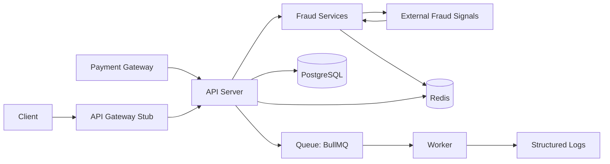
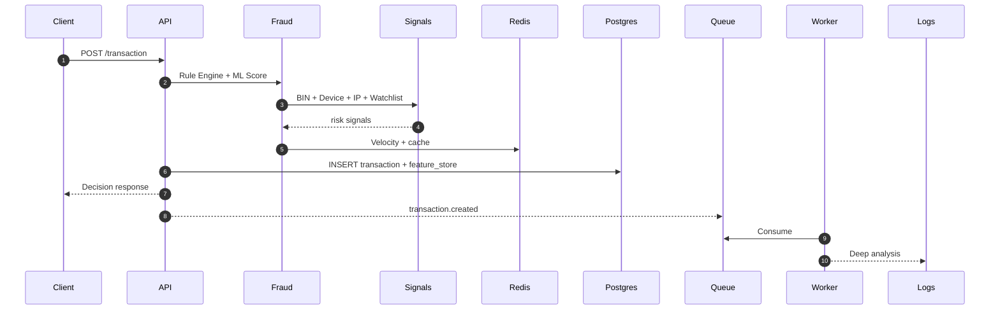

# Real-Time Fraud Detection System (Node.js)

A production-style, event-driven fraud detection prototype that evaluates transactions in real time, enriches them with external signals, persists them to PostgreSQL, and performs async deep analysis via BullMQ.

## Features Supported

- Real-time fraud decisioning (BLOCK / FLAG / APPROVE)
- Rule engine: velocity + amount threshold checks
- Mock or external ML scoring (feature-flagged)
- External signal enrichment (BIN, device fingerprint, IP reputation)
- Watchlist checks (stub or external)
- Historical pattern analysis from PostgreSQL
- Redis caching + velocity counters
- Queue-based async processing with BullMQ worker
- PostgreSQL persistence for transactions + feature store
- Payment gateway webhook ingestion and update flow
- API gateway stub with optional API key
- Structured logging

## Part 1: High-Level Architecture

**Core Components**
- **API Gateway Stub**: `src/gateway/auth.js` simulates gateway-level auth via `GATEWAY_API_KEY`.
- **Transaction Processing**: `src/services/transactionService.js` orchestrates scoring, persistence, and caching.
- **Fraud Detection Engine**: rules + ML scoring + enrichment + historical analysis.
- **Database Layer**: PostgreSQL for transactions + feature store.

**Integration Points**
- **Payment Gateways**: Webhook ingestion at `POST /webhooks/payment`.
- **External Fraud Databases**: BIN lookup, device fingerprinting, IP reputation, watchlist checks.
- **External ML Scoring**: optional via adapter with retries and circuit breaker.

**Data Flow**
- **Synchronous**: API request ? rules ? enrichment ? ML scoring ? decision ? DB + cache ? response.
- **Asynchronous**: event enqueued ? worker consumes ? deep analysis logs.

**Technology Choices**
- **Compute**: Node.js + Express for IO-heavy, real-time APIs.
- **Messaging**: BullMQ (Redis-backed) for async processing.
- **Database**: PostgreSQL for durability, auditability, SQL analytics.
- **Caching**: Redis for velocity counters and decision cache.

## Architecture Diagram



## Data Flow Diagram



## Part 2: Event-Driven Deep Dive

**Transaction evaluation includes**
- **Rule Engine**: velocity and amount thresholds.
- **ML Scoring**: fraud probability (mock or external adapter).
- **Watchlist Checks**: external or stubbed list matching.
- **Historical Patterns**: Postgres-backed user behavior stats.

**Async Flow**
- API emits a `transaction.created` event to BullMQ.
- Worker performs deeper analysis without blocking the API.

## Gateway Flow (Webhook Update)

**Behavior**
- If `transactionId` is provided, webhook updates that transaction.
- If `provider + eventId` already exists, webhook is treated as duplicate.
- Otherwise, webhook creates a new transaction and runs scoring.

## Project Structure

```
src/
  api/
    routes/
    controllers/
  services/
    fraud/
      ruleEngine.js
      mlService.js
      aggregator.js
      enrichmentService.js
      historicalService.js
    transactionService.js
  queue/
    producer.js
    worker.js
  cache/
    redisClient.js
  gateway/
    auth.js
  db/
    postgres.js
    migrate.js
    schema.sql
    seed.js
  integrations/
    adapters/
      httpAdapter.js
    ml/
      mlScoringClient.js
    paymentGateway/
      adapter.js
      webhookVerifier.js
    fraudSignals/
      binLookup.js
      deviceFingerprint.js
      ipReputation.js
      watchlist.js
      watchlistClient.js
  models/
    transactionRepository.js
    featureStoreRepository.js
  utils/
  config/
  app.js
server.js
ROADMAP.md
```

## Setup & Execution

1. Install dependencies
```
npm install
```

2. Configure environment
```
copy .env.example .env
```

3. Start Redis
```
docker compose up -d redis
```

4. Start PostgreSQL
```
docker compose up -d postgres
```

5. Run migration
```
npm run db:migrate
```

6. Seed sample history (optional)
```
npm run db:seed
```

7. Start API and Worker (separate terminals)
```
npm run dev
```
```
npm run worker
```

## Environment Variables (with descriptions)

| Variable | Description |
| --- | --- |
| `REDIS_URL` | Redis connection string |
| `DATABASE_URL` | PostgreSQL connection string |
| `AMOUNT_THRESHOLD` | Rule engine amount threshold |
| `VELOCITY_WINDOW_SEC` | Velocity time window (seconds) |
| `VELOCITY_MAX_TX` | Max tx per window before rule triggers |
| `ML_TIMEOUT_MS` | Max time to wait for ML score |
| `DECISION_CACHE_TTL_SEC` | Redis decision cache TTL |
| `HISTORICAL_WINDOW_DAYS` | Lookback window for historical stats |
| `HISTORICAL_AMOUNT_SPIKE` | Multiplier to detect spikes |
| `HISTORICAL_MAX_TX` | Count threshold for high velocity |
| `WATCHLIST_USER_IDS` | Comma-separated watchlisted users |
| `WATCHLIST_DEVICE_IDS` | Comma-separated watchlisted devices |
| `GATEWAY_API_KEY` | API key required for `/transaction` |
| `PAYMENT_WEBHOOK_SECRET` | HMAC secret for gateway webhooks |
| `USE_REAL_ML` | Switch to external ML adapter |
| `ML_SCORING_ENDPOINT` | External ML scoring endpoint |
| `USE_REAL_WATCHLIST` | Switch to external watchlist adapter |
| `WATCHLIST_ENDPOINT` | External watchlist endpoint |

## API Usage (Updated cURL)

### Create Transaction
```
curl --location 'http://localhost:3000/transaction' \
--header 'Content-Type: application/json' \
--data '{
  "userId": "user-123",
  "amount": 1250,
  "deviceId": "device-abc",
  "cardBin": "411111",
  "ipAddress": "203.0.113.10"
}'
```

### Payment Gateway Webhook (Update Existing Transaction)
```
curl --location 'http://localhost:3000/webhooks/payment' \
--header 'Content-Type: application/json' \
--data '{
  "eventId": "evt_123",
  "status": "AUTHORIZED",
  "transactionId": "<PASTE_TRANSACTION_ID>",
  "provider": "mock-payments",
  "userId": "user-123",
  "amount": 1250,
  "deviceId": "device-abc",
  "cardBin": "411111",
  "ipAddress": "203.0.113.10"
}'
```

## Feature Store

The `feature_store` table captures enriched features and model metadata for each transaction.
The `transactions` table also stores `device_id`, `ip_address`, `card_bin`, `provider`, and `gateway_event_id`.

## Demo Steps (Interview-Ready)

1. Start Redis + Postgres
2. Run `npm run db:migrate`
3. Run `npm run db:seed`
4. Start API + Worker
5. Send `/transaction` request and show response
6. Send `/webhooks/payment` with `transactionId`
7. Show worker logs for async analysis
8. Show DB rows in `transactions` and `feature_store`

## Key Design Decisions

- **Separation of concerns** keeps API, fraud logic, and persistence isolated.
- **Event-driven design** keeps the API fast while worker runs heavy analysis.
- **Feature flags** allow switching between mock and real integrations.
- **Adapters with circuit breaker** provide resilience to external services.

## Roadmap

See `ROADMAP.md` for future scope items and planned enhancements.
