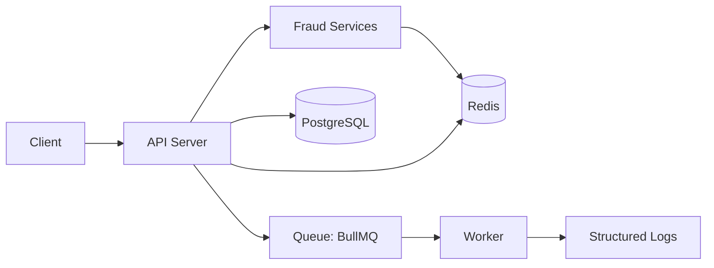
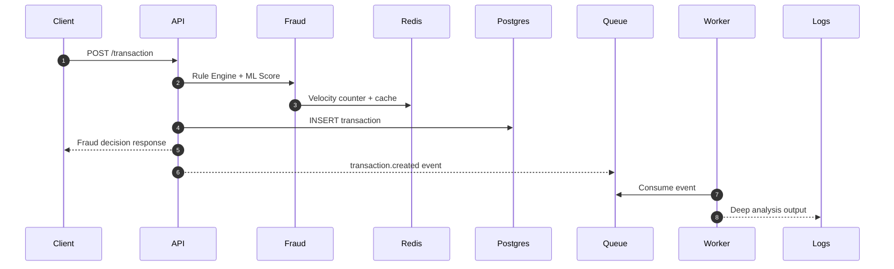

# Real-Time Fraud Detection System (Node.js)

A production-style prototype that simulates real-time fraud detection using rule checks, mock ML scoring, Redis caching, and async processing via BullMQ. It now includes PostgreSQL persistence for all transactions.

## Architecture Diagram



## Data Flow Diagram



## Project Structure

```
src/
  api/
    routes/
    controllers/
  services/
    fraud/
      ruleEngine.js
      mlService.js
      aggregator.js
    transactionService.js
  queue/
    producer.js
    worker.js
  cache/
    redisClient.js
  db/
    postgres.js
    migrate.js
    schema.sql
  models/
    transactionRepository.js
  utils/
  config/
app.js
server.js
```

## Setup & Execution

### 1) Install dependencies

```
npm install
```

### 2) Configure environment

```
copy .env.example .env
```

### 3) Start Redis

```
docker compose up -d redis
```

### 4) Start PostgreSQL

Option A: Docker (recommended)

```
docker compose up -d postgres
```

Option B: pgAdmin (local install)

1. Create a database named `fraud_detection`
2. Ensure your `.env` matches your local credentials

### 5) Run database migration

```
npm run db:migrate
```

### 6) Start API and worker (separate terminals)

```
npm run dev
```

```
npm run worker
```

## Environment Variables

Key values are in `.env.example`:

- `REDIS_URL`
- `DATABASE_URL`
- `AMOUNT_THRESHOLD`
- `VELOCITY_MAX_TX`
- `ML_TIMEOUT_MS`

## API Usage

### POST /transaction

Request:

```json
{
  "userId": "user-123",
  "amount": 1250,
  "deviceId": "device-abc"
}
```

Example curl:

```
curl -X POST http://localhost:3000/transaction \
  -H "Content-Type: application/json" \
  -d '{"userId":"user-123","amount":1250,"deviceId":"device-abc"}'
```

Sample response:

```json
{
  "transactionId": "d4fb6a88-3e7e-43d7-a9d1-8b4ed3d98959",
  "userId": "user-123",
  "amount": 1250,
  "deviceId": "device-abc",
  "decision": "APPROVE",
  "score": 0.4321,
  "triggeredRules": [],
  "ruleResults": [
    {
      "id": "velocity_check",
      "passed": true,
      "reason": "User has 2 tx in 60s",
      "meta": {
        "count": 2,
        "windowSec": 60,
        "exceeded": false,
        "skipped": false
      }
    },
    {
      "id": "amount_threshold",
      "passed": true,
      "reason": "Amount within threshold",
      "meta": {
        "amount": 1250,
        "threshold": 10000
      }
    }
  ],
  "mlResult": {
    "model": "mock-ml-v1",
    "score": 0.4321,
    "latencyMs": 71,
    "timedOut": false
  },
  "evaluatedAt": "2026-03-23T10:12:45.123Z",
  "cache": {
    "hit": false,
    "key": "decision:..."
  }
}
```

## End-to-End Testing

### 1) Send a transaction

Use the curl command above.

### 2) Expected API logs

```
{"level":30,"transaction":{"id":"...","userId":"user-123","amount":1250,"deviceId":"device-abc"},"msg":"Incoming transaction"}
{"level":30,"transactionId":"...","decision":"APPROVE","score":0.4321,"msg":"Fraud decision generated"}
```

### 3) Expected worker logs

```
{"level":30,"jobId":"...","transaction":{"transaction":{"id":"..."},"decision":{"decision":"APPROVE"}},"msg":"Processing transaction event"}
{"level":30,"jobId":"...","analysis":{"deepScore":0.91,"latencyMs":321,"recommendation":"ESCALATE"},"msg":"Deep fraud analysis complete"}
```

### 4) Verify database record

Example query:

```
SELECT * FROM transactions ORDER BY created_at DESC LIMIT 5;
```

## Demo Guide

1. Start Redis and PostgreSQL
2. Run `npm run db:migrate`
3. Start the API server
4. Start the worker
5. Send a POST `/transaction` request
6. Show API response
7. Show worker logs for async processing
8. Show the DB row in pgAdmin or via SQL

## Key Design Decisions

- **Separation of concerns**: API, fraud logic, persistence, and async processing are isolated by module.
- **Event-driven**: Queue decouples response latency from deep analysis.
- **Resilience**: Redis failures fall back gracefully; ML scoring enforces timeouts.
- **Extensibility**: New fraud rules or ML models can be added without API changes.

## Docker (Optional)

Run the full stack:

```
docker compose up --build
```

Then run migrations from the host:

```
npm run db:migrate
```
